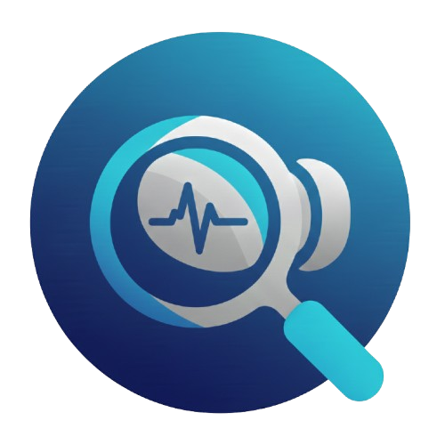

<div align="center">
  
  <h1 style="margin-top: 0px;">SoundScout</h1>
  <p><i>Navigate the Noise, Find Your Perfect Sound</i></p>
</div>

[Find Your Perfect Sound Here!](https://huggingface.co/spaces/zikosetyawan/soundscout-app) 
---

## 📌 Program Description
**SoundScout** adalah sistem rekomendasi produk True Wireless Stereo (TWS) yang dirancang untuk membantu pengguna menemukan TWS yang paling sesuai dengan kebutuhan dan preferensi mereka. Sistem ini memanfaatkan analisis ulasan pelanggan berbasis Natural Language Processing (NLP) untuk menghasilkan rekomendasi produk yang relevan, informatif, dan mendukung pengambilan keputusan pembelian secara lebih efisien.

## 📖 Problem Background

Pesatnya adopsi produk True Wireless Stereo (TWS) saat ini didorong oleh perubahan gaya hidup digital yang menuntut mobilitas tinggi serta kebijakan produsen smartphone yang mulai meniadakan jack audio fisik. TWS telah menjadi kebutuhan esensial karena menawarkan fleksibilitas tanpa kabel, integrasi asisten suara, dan fitur pendukung produktivitas seperti peredam bising, yang menjadikannya pilihan utama baik untuk bekerja maupun hiburan. Namun, tingginya permintaan ini memicu membanjirnya berbagai model dan merek di pasar, sehingga konsumen sering kali terjebak dalam kebingungan saat harus memilih produk yang memiliki kualitas suara dan kenyamanan yang sesuai dengan preferensi pribadi mereka di tengah ribuan opsi yang tersedia.

Guna memberikan solusi yang relevan, project ini mengembangkan sistem rekomendasi yang berfokus pada ekstraksi informasi dari ulasan pengguna menggunakan teknik Natural Language Processing (NLP) dengan model Word2Vec. Pemilihan data ulasan sebagai sumber utama didasarkan pada fakta bahwa opini pengguna mengandung pengalaman nyata yang lebih mendalam dibandingkan spesifikasi teknis di atas kertas. Melalui pendekatan word embedding, model Word2Vec mampu memahami konteks semantik dan hubungan antar kata dalam ulasan, sehingga sistem dapat mengidentifikasi kemiripan produk berdasarkan sentimen dan deskripsi pengalaman pengguna. Pendekatan ini diharapkan mampu menghasilkan rekomendasi TWS yang lebih akurat dan personal, membantu calon pembeli menavigasi pasar yang padat dengan bantuan konsensus pengalaman pengguna lain.

## 🎯 Project Objective

Berdasarkan permasalahan yang diidentifikasi dalam project ini, tujuan yang ingin dicapai antara lain:

* **Pengembangan Sistem Rekomendasi**: Mengembangkan aplikasi sistem rekomendasi yang dapat membantu pengguna dalam menentukan produk *True Wireless Stereo* (TWS) yang sesuai dengan kebutuhan, preferensi penggunaan, dan spesifikasi yang diinginkan.
* **Personalisasi & Ringkasan Ulasan**: Memberikan rekomendasi **Top 3** produk TWS yang paling relevan bagi pengguna, disertai ringkasan ulasan (*review*) produk berdasarkan pengalaman pembelian dan penggunaan sebelumnya.
* **Insight untuk Produsen**: Menyediakan *insight* bagi brand atau produsen TWS terkait peluang peningkatan kualitas produk berdasarkan hasil analisis sentimen dan opini pelanggan.
* **Efisiensi Strategi Pemasaran**: Mendukung efisiensi strategi pemasaran dengan membantu brand menekan *Cost Per Acquisition* (CPA) serta mempercepat proses pengambilan keputusan pembelian oleh konsumen.

## 📊 Dataset Information
Dataset ini dikumpulkan melalui proses *web scraping* menggunakan **BeautifulSoup4**. Data mentah divalidasi dan dibersihkan untuk memastikan kualitas fitur yang digunakan dalam pemodelan.

| Nama Kolom | Jenis Data | Deskripsi |
| :--- | :--- | :--- |
| `product` | String | Nama lengkap produk TWS. |
| `feature` | String | Deskripsi fitur teknis |
| `brand` | String | Merek atau produsen perangkat. |
| `price` | Float | Harga produk. |
| `rating` | Float | Skor penilaian dari pengguna. |
| `color` | String | Varian warna yang tersedia. |
| `ear_placement` | String | Desain penggunaan di telinga (e.g., In-Ear, Semi-in-Ear). |
| `form_factor` | String | Faktor bentuk fisik perangkat (e.g., True Wireless). |
| `impedance` | String| Ukuran hambatan listrik pada sirkuit audio (Ohm). |
| `image_url` | String | Tautan menuju gambar produk untuk visualisasi. |
| `reviews` | String | Kumpulan ulasan pengguna untuk analisis sentimen/konteks. |

## 🛠️ Technology Stack & Libraries

Proyek ini dibangun menggunakan **Python** dan **SQL** sebagai bahasa utama, dengan dukungan ekosistem library berikut:

| No | Library | Fungsi |
| :--- | :--- | :--- |
| 1 | **Pandas** | Mengolah dan memanipulasi data tabel |
| 2 | **Numpy** | Perhitungan matematis dan array |
| 3 | **Seaborn** | Visualisasi data statistik |
| 4 | **Wordcloud** | Visualisasi kata yang paling sering muncul |
| 5 | **NLTK** | Text Pre-processing (NLP) |
| 6 | **SK-Learn** | Pengembangan model machine learning |
| 7 | **Gensim** | Vectorization menggunakan model Word2Vec |
| 8 | **Streamlit** | Pembuatan antarmuka aplikasi (Deployment) |
| 9 | **ScraperAPI** | Integrasi API untuk menembus proteksi scraping |
| 10 | **BS4 (BeautifulSoup)** | Data Scraping|

**Tools Pendukung:**
* **VSCode**: Sebagai Text Editor utama untuk pengembangan kode.
* **Hugging Face**: Platform untuk *Model Deployment*.
* **Tableau**: Digunakan untuk visualisasi data yang lebih interaktif dan mendalam.

## 📊 Data Pipeline & Methodology

1.  **Data Acquisition**: Scraping data produk TWS dari E-Commerce Amazon
2.  **Data Cleaning & Validation**: 
    * Standardisasi penamaan fitur produk.
    * Menghilangkan duplicate data.
    * Pemberian kolom baru 'feature' berdasarkan spliting nama produk
    * Pembuatan dataset review untuk modeling.
    * Validasi data menggunakan Great Expectations
3.  **Exploratory Data Analysis (EDA)**: Analisis distribusi harga, merek terpopuler dan rata-rata rating
4.  **Modeling**:
    * Melakukan representasi teks fitur produk ke dalam ruang vektor menggunakan **Word2Vec**.
    * Menghitung kedekatan antar produk menggunakan *Cosine Similarity*.
5.  **Recommendation**: Menampilkan daftar 3 produk terbaik berdasarkan kemiripan fitur dengan input preferensi pengguna.

## 📂 Project Structure

```text
├── data_scraped/             # Kumpulan file json hasil scrapping
├── scrape_and_cleaning/      # Script pembersihan dan validasi data
├── EDA.ipynb                 # Notebook Explorayoty Data Analysis
├── modeling.ipynb            # Notebook implementasi Word2Vec & Rekomendasi
└── README.md                 # Dokumentasi proyek
```

## 📩 Contact Information

Jika Anda memiliki pertanyaan mengenai proyek ini atau ingin berkolaborasi, silakan hubungi tim kami:

| Nama Anggota | Kontak | GitHub |
| :--- | :--- | :--- |
| **Muhammad Zhafir Abdurrahman** | [](mailto:muhammadzhafirabdurrahman@gmail.com) | [](https://github.com/zhafirabdurrahman) | [](https://linkedin.com/in/muhammadzhafirabdurrahman) |
| **Ivan Carlos T** | [](mailto:muhammadzhafirabdurrahman@gmail.com) | [](https://github.com/zhafirabdurrahman) | [](https://linkedin.com/in/muhammadzhafirabdurrahman) |
| **Muhammad Ziko** | [](mailto:muhammadzhafirabdurrahman@gmail.com) | [](https://github.com/zhafirabdurrahman) | [](https://linkedin.com/in/muhammadzhafirabdurrahman) |


[](https://www.python.org/)
[](https://streamlit.io/)
[](https://www.crummy.com/software/BeautifulSoup/)
[](https://radimrehurek.com/gensim/models/word2vec.html)
[](https://huggingface.co/)
